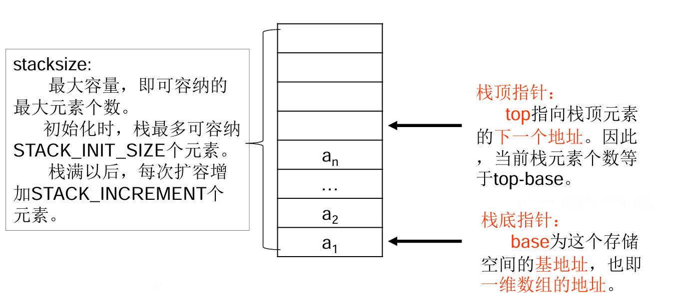
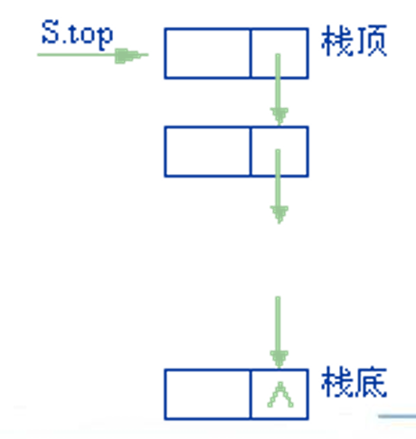
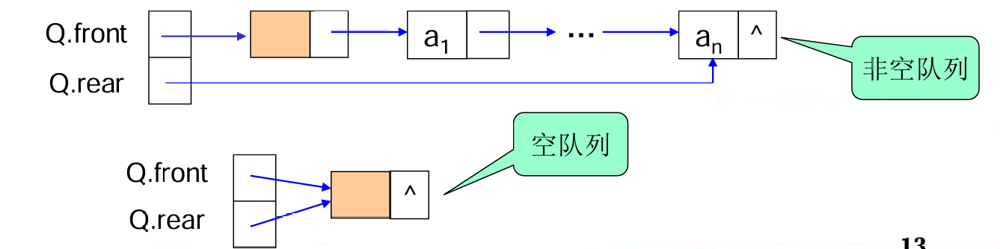

# 栈
---

<!-- TOC -->
  * [# 栈](#-栈)
  * [1.顺序栈](#1顺序栈)
  * [2.链式栈](#2链式栈)
  * [3.栈的应用](#3栈的应用)
* [队列](#队列)
  * [1.链队列](#1链队列)
  * [2.循环队列](#2循环队列)
  * [3.队列的应用](#3队列的应用)
<!-- TOC -->

---

栈(Stack)是限定只能在表的一端进行插入和删除操作的线性表。在表中，允许插入和删除的一端称作“栈顶(top)”，不允许插入和删除的另一端称作“栈底(bottom)” 。当表中没有元素时称为空栈。

特性：后入先出

## 1.顺序栈

- 有base和top指针，初始时top = base，元素入栈时赋值到top指向的地址，top++，出栈相反

## 2.链式栈

- 由于栈只在栈顶作插入和删除操作，因此链栈中不需要头结点，但要注意链栈中指针的方向是从栈顶指向栈底
  的，这正好和单链表是相反的。
  

## 3.栈的应用

- 括号匹配：用栈实现括号匹配的原理是基于栈的“后进先出”（LIFO, Last In First Out）特性。具体来说,当遇到一个左括号（如 (、[、{）时，将其压入栈中；当遇到一个右括号（如 )、]、}）时，检查栈顶的元素是否与该右括号匹配。如果匹配，则将栈顶元素弹出；如果不匹配，则说明括号不匹配。 

---
# 队列

队列(Queue)也是一种运算受限的线性表。它只允许在表的一端进行插入，而在另一端进行删除。允许**删除**的一端称为**队头**(front)，允许**插入**的一端称为**队尾**(rear)

特性：先入先出

## 1.链队列

- 有两个指针front和rear，初始情况下两指针都指向一个空节点，插入元素时将rear指针指向的元素的next指向新插入的元素再修正rear，删除元素时将空节点的next指针指向next指向的元素的next

## 2.循环队列

- 循环队列用一维数组实现，有front和rear指针，初始时front = rear = 0
- 判空：front == rear
- 判满：front == （rear + 1）% length

## 3.队列的应用

- 杨辉三角：通过循环队列，我们可以逐行生成杨辉三角的元素，并利用队列的先进先出特性来实现元素的计算和存储。

