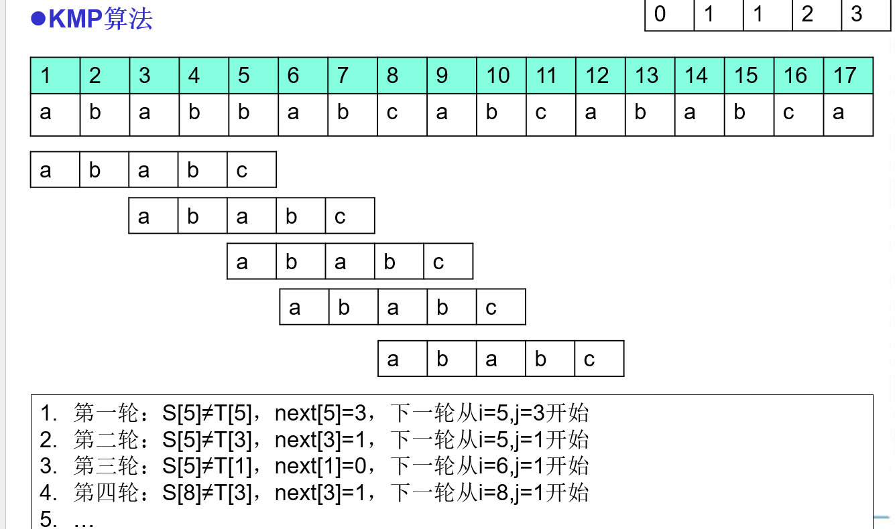

# 串

<!-- TOC -->
* [串](#串)
  * [1.串的常见操作](#1串的常见操作)
  * [2.串的实现](#2串的实现)
  * [3.串的匹配算法](#3串的匹配算法)
<!-- TOC -->

## 1.串的常见操作

- Concat,Replace,SubString,Index等

## 2.串的实现

- 串是特殊的线性表，C语言中可以用char数组来实现
- 以\0来标识串的结束

## 3.串的匹配算法

- KMP算法：核心思想是通过预处理模式字符串，避免在匹配失败时回溯主字符串的指针，从而提高匹配效率。
  时间复杂度O(m + n)

1.构造部分匹配表（next数组）

- 部分匹配表记录了模式字符串中每个位置的最长公共前后缀长度。
- 当匹配失败时，根据部分匹配表的值，可以确定模式字符串应该向右移动的距离。

| 模式字符串 | A | B | A | B | C |
|-------|---|---|---|---|---|
| 位置    | 1 | 2 | 3 | 4 | 5 |
| next  | 0 | 1 | 1 | 2 | 3 |

2.匹配过程

- 使用两个指针：i 指向主字符串，j 指向模式字符串。
- 如果当前字符匹配成功，则 i 和 j 都向后移动。
- 如果当前字符匹配失败，则根据部分匹配表的值调整 j 的位置，避免 i 回溯。

