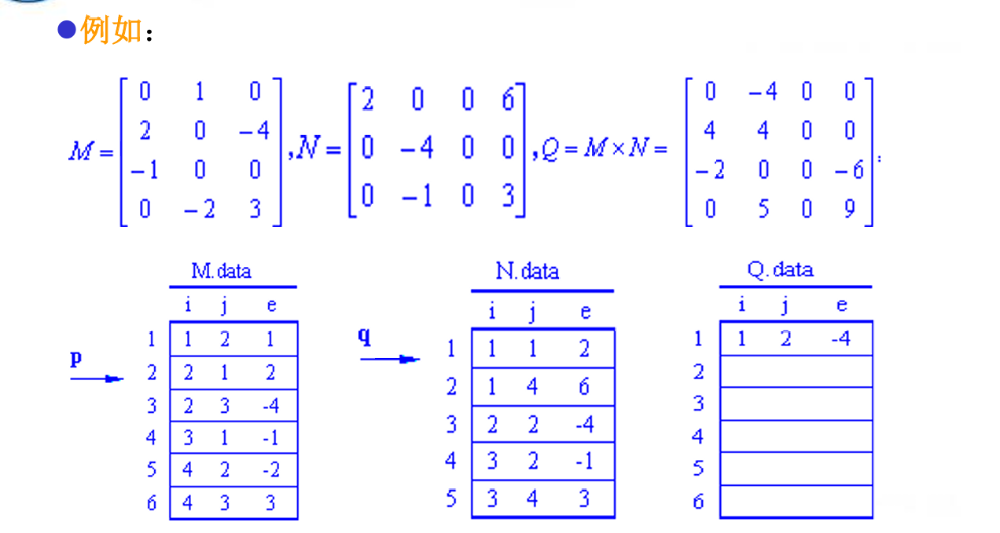
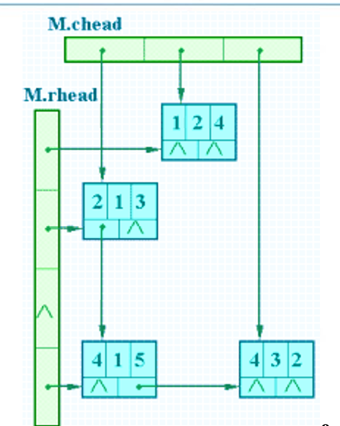
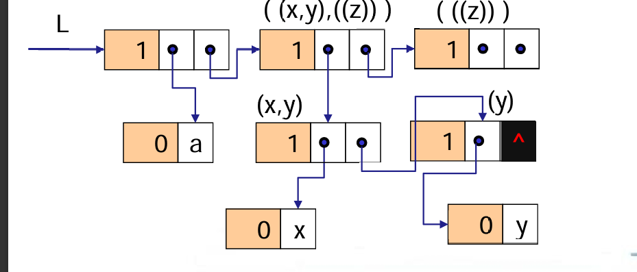

# 数组和广义表

---

<!-- TOC -->
* [数组和广义表](#数组和广义表)
  * [数组](#数组)
    * [1.顺序存储](#1顺序存储)
    * [2.矩阵压缩存储](#2矩阵压缩存储)
      * [1）稀疏矩阵快速转置](#1稀疏矩阵快速转置)
      * [2）稀疏矩阵乘法](#2稀疏矩阵乘法-)
      * [3）十字链表](#3十字链表)
  * [广义表](#广义表)
    * [常见操作](#常见操作)
    * [存储结构](#存储结构)
<!-- TOC -->
## 数组

### 1.顺序存储

对于N维数组arr[b1][b2][b3]...[bn]

- **行优先**：从bn维向b1维枚举
- **列优先**：从b1维向bn维枚举

计算**行优先**存储地址：  
假设三维数组R[p][m][n]中每个数据元素占L个存储地址，并
以LOC(i,j,k)表示下标为(i,j,k)的数据元素的存储地址，则：    
LOC(i,j,k)=LOC(0,0,0)+(i×m×n+j×n+k)×L

### 2.矩阵压缩存储

- **稀疏矩阵**：如果矩阵中只有少量的非零值元，并且这些非零值元在矩阵中的分布
  没有一定规律，则称为随机稀疏矩阵，简称为稀疏矩阵。
- 存储结构：三元线性表，每个元素(i,j,e)表示(行，列，值)

#### 1）稀疏矩阵快速转置

- **核心思想**：预先确定矩阵M中的每一列的第一个非零元素在数组T中应有的位置
- 实现思路：设置两个一维数组num[col]和cpot[col]
- num[col]：M中每列非零元素的个数
- cpot[col]：M中每列第一个非零元素在T中的位置，cpot[col]=cpot[col-1]+num[col-1]

生成过程：先统计num[],根据num[]推导出cpot[],最后遍历原矩阵M，对于每一个元素
先获得它的列值，再根据cpot找到这一列的第一个元素应该在的位置，最后该列cpot自增。

问题：为什么能保证先遍历到的元素先出现？  
答：原矩阵按行优先排列，对于原矩阵中同一列的元素，遍历中先出现的元素行号小于后出现
元素的行号，即转置后先出现元素列号小于后出现元素列号。

```c++
   Status FastTransposeSMatrix(TSMatrix M, TSMatrix &T) {
    // 采用三元组顺序表存储表示，求稀疏矩阵M的转置矩阵T
    T.mu = M.nu;  // T的行数是M的列数
    T.nu = M.mu;  // T的列数是M的行数
    T.tu = M.tu;  // T的非零元素个数与M相同
    
    if (T.tu) {
        // 初始化 num 数组：记录每列非零元素的个数
        for (col = 1; col <= M.nu; ++col)
            num[col] = 0;
        
        // 计算每列非零元素的个数
        for (t = 1; t <= M.tu; ++t) {
            ++num[M.data[t].j];  // M.data[t].j是M矩阵中元素所在的列
        }

        // cpot[col]存储转置矩阵中每列起始位置的索引
        cpot[1] = 1;  // 初始化第一列在T中的存储位置
        for (col = 2; col <= M.nu; ++col)
            cpot[col] = cpot[col - 1] + num[col - 1];

        // 转置矩阵 T 中每一行的第一个非零元素的位置
        for (p = 1; p <= M.tu; ++p) {
            col = M.data[p].j;   // 获取矩阵 M 中第 p 个非零元素的列
            q = cpot[col];       // 获取转置矩阵 T 中第 col 列的起始位置
            T.data[q].i = M.data[p].j;  // 行号转置为列号
            T.data[q].j = M.data[p].i;  // 列号转置为行号
            T.data[q].e = M.data[p].e;  // 值不变
            
            ++cpot[col];  // 更新转置矩阵 T 中该列的起始位置
        }
    }  // if

    return OK;
}  // FastTransposeSMatrix
```

#### 2）稀疏矩阵乘法 

行逻辑链接：cpot[]数组来指示每一行首个非零元素位置

- **核心思想**：根据cpot[]数组来把每一行的每一个元素乘上另一个矩阵对应行所有元素
并在结果矩阵中累加相乘结果。



#### 3）十字链表

- 对于每一个节点有一个right指针和down指针，对于矩阵有两个节点一维数组cheaed和rhead
分别表示列头节点和行头节点




---

## 广义表

广义表是n(n>=0)个元素a1,a2,a3,…,an的有限序列，其中ai或者是
原子项，或者是一个广义表。通常记作LS=（a1,a2,a3,…,an)

### 常见操作

- Head：取广义表的首个元素
- Tail：去掉广义表首个元素后的表
- e.g. LS = (A,(B,C),D)  Head(LS) = A, Tail(LS) = ((B,C),D)


### 存储结构

- 对于每一个节点，有标识位，0代表ATOM，1代表LIST

