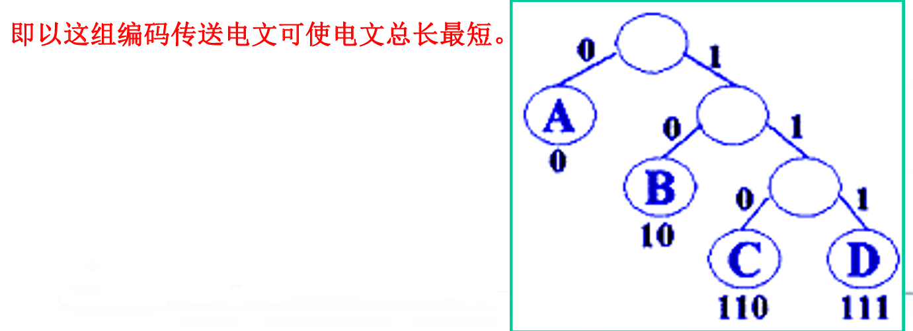
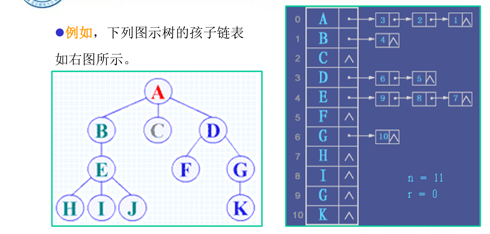
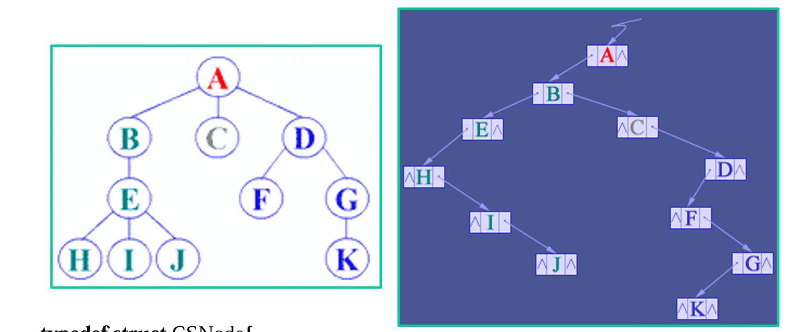

# 树和森林

---

<!-- TOC -->
* [树和森林](#树和森林)
  * [树](#树-)
    * [1.二叉树](#1二叉树)
      * [1)基本性质](#1基本性质)
      * [2）存储结构](#2存储结构)
    * [2.二叉树的遍历](#2二叉树的遍历)
    * [3.线索二叉树](#3线索二叉树)
    * [4.赫夫曼树](#4赫夫曼树)
  * [森林](#森林)
    * [1.存储结构](#1存储结构)
    * [2.二叉树和森林的转换](#2二叉树和森林的转换)
    * [3.树和森林的遍历](#3树和森林的遍历)
<!-- TOC -->

---

## 树    

> 定义：树(Tree)是n(n>=0)个结点的有限集T，它满足如下两个条件  
>  (1)有且仅有一个特定的称为根(Root)的结点；    
>  (2) 其余的结点可分为m(m>=0)个互不相交的子集T1,T2,T3…Tm，其中每个子集又是一棵树，
并称其为子树(Subtree)     
> 与线性结构的区别：唯一前驱，多个后继    

### 1.二叉树

> 二叉树是由n(n>=0)个结点的有限集合构成，此集合或者为空集，
或者由一个根结点及两棵互不相交的左、右子树组成，并且左右子
树都是二叉树。 

#### 1)基本性质

- 性质1：在二叉树的第i层上至多有2i-1个结点(i>=1)
- 性质2：深度为k的二叉树至多有2^k－1个结点（k>=1)
- 性质3： 对任何一棵二叉树，如果其叶子结点数为n0，度为2的结点数为n2，则n0＝n2＋1。

满二叉树和完全二叉树：  

- 一棵深度为k且由2k-1个结点的二叉树称为满二叉树
- 深度为k、由n个结点的二叉树中，当且仅当其每一个结点能
  够与深度为k的顺序编号的满二叉树从1到n标号的结点相对应，则
  称这样的二叉树为完全二叉树
- 完全二叉树的特点是：(1) 所有的叶结点只可能在层次最大的两层上出现(2) 对任一结点，如果其右子树的最大层次为L，则其左子
  树的最大层次为L或L ＋1

#### 2）存储结构

**顺序存储**：用一组连续的存储单元存储二叉树的数据元素，假设一个节点的编号是n，那么它的左孩子
编号为2n，右孩子编号为2n+1    
缺点：需要大量的空间，树不满时容易造成浪费，不方便增加和删除节点    

**链式存储**：每个节点有数据域和指针域lchild和rchild，分别指向左孩子和右孩子，也可以增设
指针parent指向双亲(三叉链表)

### 2.二叉树的遍历

- 先序遍历：先访问根节点，再先序遍历左子树，最后先序遍历右子树
- 中序遍历：先中序遍历左子树，再访问根节点，最后中序遍历右子树
- 后序遍历：先后序遍历左子树，再后序遍历右子树，最后访问根节点

中序遍历示例：
```java
  public class InOrderDemo {
  public static void main(String[] args) {
    TreeNode n1 = new TreeNode(1);
    TreeNode n2 = new TreeNode(2);
    TreeNode n3 = new TreeNode(3);
    TreeNode n4 = new TreeNode(4);
    TreeNode n5 = new TreeNode(5);
    TreeNode n6 = new TreeNode(6);

    n1.lchild = n2;
    n1.rchild = n3;

    n2.lchild = n4;
    n2.rchild = n5;

    n3.rchild = n6;

    System.out.print("InOrder:  ");
    InOrderTraversal(n1);
  }

  public static void InOrderTraversal(TreeNode node){
    if(node == null){
      return;
    }
    InOrderTraversal(node.lchild);
    System.out.print(node.data + "  ");
    InOrderTraversal(node.rchild);
  }
}

class TreeNode{
  int data;
  TreeNode lchild = null;
  TreeNode rchild = null;

  public TreeNode(int data) {
    this.data = data;
  }
}
```

Try:已知二叉树的中序序列：DCBGEAHFIJK，后序：DCEGBFHKJIA，画出二叉树

### ~~3.线索二叉树~~

- **思想**：不浪费未存储信息的lchild和rchild域，设置LTag和RTag，当Tag = 0时child指向左右孩子，Tag = 1时lchild指向前驱，rchild指向后继（中序遍历下）
- **实现**：用一个全局变量pre来记录线索化过程中的前驱节点，中序线索化过程中如果遇到没有左子树的节点，就把这个节点的lchild指向前驱，如果前驱也没有右子树，就把前驱的rchild指向当前节点，最后更新pre为当前节点

```java
    // 中序线索化
public static void inorderThreading(ThreadedNode root) {
  if (root == null) {
    return;
  }
  // 线索化左子树
  inorderThreading(root.left);

  // 处理当前结点
  if (root.left == null) {
    root.left = prev;
    root.ltag = true; // 左指针指向前驱
  }

  if (prev != null && prev.right == null) {
    prev.right = root;
    prev.rtag = true; // 前驱结点的右指针指向当前结点
  }

  prev = root; // 更新前驱结点为当前结点

  // 线索化右子树
  inorderThreading(root.right);
}
```

### 4.赫夫曼树

背景：通信编码   
要使：最常出现的字符占用最短的编码，缩短信息总长度   
模型：有若干个带有权值的节点作为叶子节点

带权路径WPL：从树根到该结点之间的路径长度与该结点上所带权值的乘积    

**构造方法**：每次选出权值最小的两个节点，创建一个新的节点作为这两个节点的双亲并取代这两个节点，不断递归直到最终只剩一个根节点，此时构造的树带权路径和最小，称为赫夫曼树



---

## 森林

### 1.存储结构

- 孩子表示法：
  - 1.把每个结点的孩子视为一个线性表。结点的度不同，因此采用链式存储结构。
  - 2.N个结点则有N个链表，它们的头指针又组成一个线性表。为方便访问，采用顺序
    存储结构。



- 孩子兄弟表示法：
  - 每个节点设有两个指针firstChild和nextSibling
  - firstChild:第一个孩子节点（类似左孩子）
  - nextSibling:当前节点的下一个兄弟节点



### 2.二叉树和森林的转换

- 参考孩子兄弟表示法

### 3.树和森林的遍历

树的遍历：
- 先根遍历：若树不空，则先访问根结点，然后依次从左到右先根遍历根的各棵子树
- 后根遍历：若树不空，则先依次从左到右后根遍历根的各棵子树，然后访问根结点

森林的遍历：
- 先序遍历：先访问森林中第一棵树的根节点，再先序遍历第一棵树的子树，最后先序遍历森林剩余树
- 中序遍历：先中序遍历第一棵树的子树森林，再访问第一棵树的根节点，最后中序遍历剩余森林


