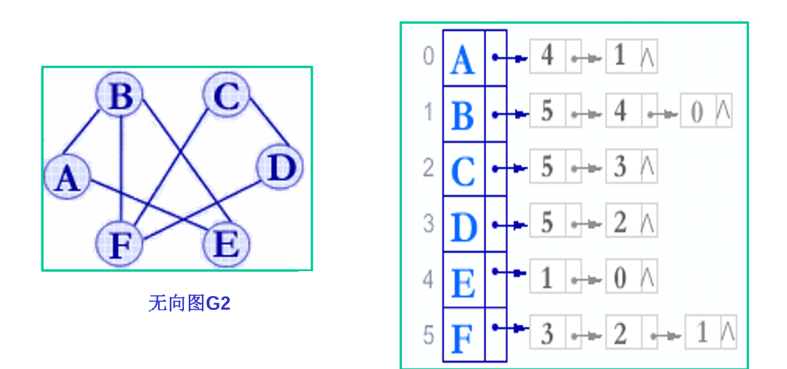
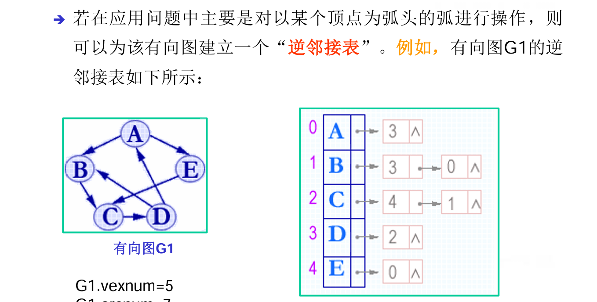
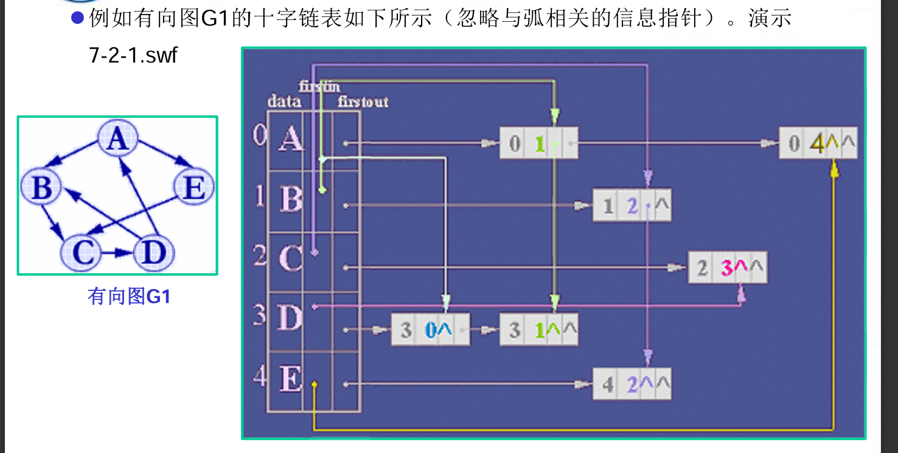
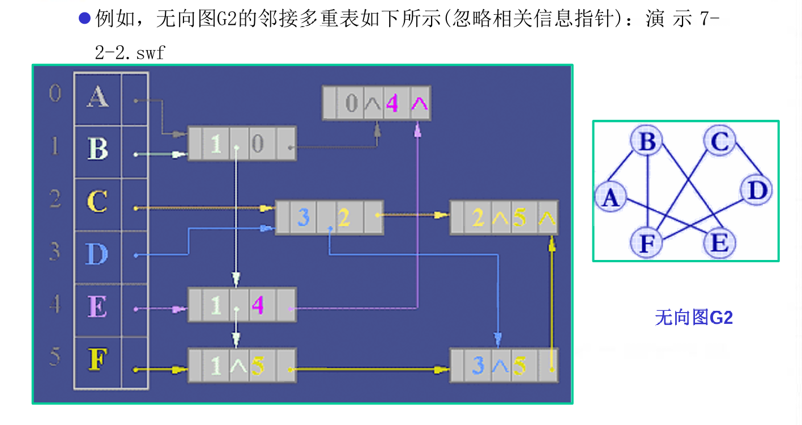
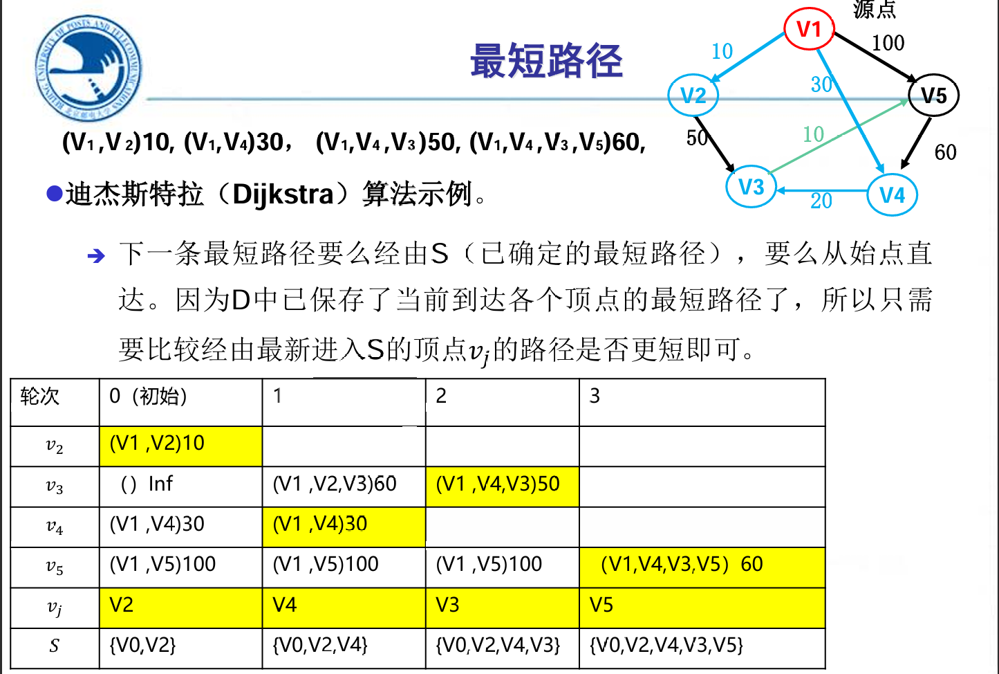
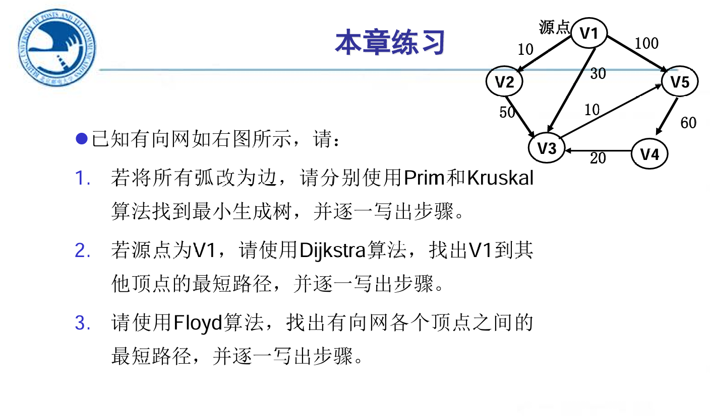

# 图

---

<!-- TOC -->
* [图](#图)
  * [1.图的定义](#1图的定义)
  * [2.图的存储结构](#2图的存储结构)
    * [1）邻接矩阵](#1邻接矩阵)
    * [2）邻接表](#2邻接表)
    * [3）十字链表](#3十字链表)
    * [4）邻接多重链表](#4邻接多重链表)
  * [3.图的遍历](#3图的遍历)
    * [1）深度优先搜索（DFS）](#1深度优先搜索dfs)
    * [2）广度优先搜索（BFS）](#2广度优先搜索bfs)
  * [4.最小生成树](#4最小生成树)
    * [1）Prim算法](#1prim算法)
    * [2）Kruskal算法](#2kruskal算法)
  * [5.图的最短路径](#5图的最短路径)
    * [1）Dijkstra算法](#1dijkstra算法)
    * [2）Floyd算法](#2floyd算法)
<!-- TOC -->

---

## 1.图的定义

**图**由一个顶点集和弧集构成，通常写作：Graph=(V,VR)。由于空的图在实际应用中没有意义，因此一般不讨论空的图，即V是**顶点**的有穷非空集合，而VR是两个**顶点之间的关系**的集合。

- 有向图：弧是有方向的，弧的起点称为**弧尾**，终点称为**弧头**，VR一般用有序对表示e.g.<A,B>
- 无向图：边是无方向的，边的两个顶点之间没有次序之分,VR一般用无序对表示e.g.(A,B)

**图的度**：

- 无向图：顶点的度是与该顶点相关联的边的数目
- 有向图：顶点的度为其出度和入度之和，其中出度（OD）定义为以该顶点为弧尾的弧的数目，入度（ID）定义为以该顶点为弧头的弧的数目

**路径**：从一个顶点到另一个顶点的一系列顶点构成的序列，路径长度是路径上的边或弧的数目

**回路**：起点和终点相同的路径

**连通性**：

- 无向图：若图中任意两个顶点之间都有路径，则称该图是连通图
- 有向图：若图中任意两个顶点之间都有方向相同的路径，则称该图是强连通图
- 连通分量：无向图中的极大连通子图称为连通分量，有向图中的极大强连通子图称为强连通分量

**网**：分别称带权的有向图和无向图为有向网和无向网。

## 2.图的存储结构

### 1）邻接矩阵

定义：用两个数组来表示图中的顶点和边，其中顶点数组存储顶点信息，边数组存储边的权值。
> 无向图的邻接矩阵是对称矩阵，有向图则不一定

### 2）邻接表

定义：用一个数组和一个链表来表示图中的顶点和边，其中数组存储顶点信息，链表存储边的信息。


- 逆邻接表：存储有向图的逆邻接表，指针数组指向以该顶点为终点的弧的起点
  

### 3）~~十字链表~~

定义：有一个节点数组，每个节点有两个指针，分别指向第一个以该节点为起点的弧和以该节点为终点的弧。

> 事实上，将该图的邻接矩阵看作稀疏矩阵，图的十字链表就是该稀疏矩阵的十字链表

### 4）~~邻接多重链表~~

定义：有一个顶点节点数组，每个顶点有一个指针指向与该顶点相关联的第一个边节点，每个边节点有两个指针，一个指向该边起点的下一条边，一个指向该边终点的下一条边。

边节点：

| mark   | ivex | ilink    | jvex | jlink    | info |
|--------|------|----------|------|----------|------|
| 标记节点访问 | 边的顶点 | i关联的下一条边 | 边的顶点 | j关联的下一条边 | 信息   |



## 3.图的遍历

### 1）深度优先搜索（DFS）
定义：从图中某个顶点v出发，访问此顶点，然后从v的未被访问的邻接点出发深度优先搜索图，直至图中所有和v有路径相通的顶点都被访问到。

```java
void DFS(int start) {
    boolean visited[] = new boolean[V];
    DFSUtil(start, visited);
}

void DFSUtil(int start, boolean visited[]) {
    visited[start] = true;
    System.out.print(start + " ");

    Iterator<Integer> i = adjList[start].listIterator();
    while (i.hasNext()) {
        int n = i.next();
        if (!visited[n]) {
            DFSUtil(n, visited);
        }
    }
}
```

### 2）广度优先搜索（BFS）
定义：从图中某个顶点v出发，访问此顶点，然后访问v的所有邻接点，再依次访问v的邻接点的邻接点，直至图中所有和v有路径相通的顶点都被访问到。

```java
void BFS(int start){
        boolean visited[] = new boolean[V];
        BFSUtil(start, visited);
    }
    
    void BFSUtil(int start, boolean visited[]){
        LinkedList<Integer> queue = new LinkedList<>();
        visited[start] = true;
        queue.add(start);

        while(queue.size() != 0){
            start = queue.poll();
            System.out.print(start + " ");

            Iterator<Integer> i = adjList[start].listIterator();
            while(i.hasNext()){
                int n = i.next();
                if(!visited[n]){
                    visited[n] = true;
                    queue.add(n);
                }
            }
        }
    }
```

## 4.最小生成树

> 最小生成树(Minimum Cost Spanning Tree)：生成树中边的权值（代价）之和最小的树。

**MST性质**：假设G = {V, { E } } 是一个连通图，U 是结点集合V 的一个非空子集。若( u, v ) 是一条代价最小的边，且u 属于U, v 属于 V-U，则必存在一棵包括边 ( u, v ) 在内的最小代价生成树。

### 1）Prim算法
**思想**：选择一个顶点作为生成树的根节点，然后从与根节点相连的边中选择代价最小的边，将该边的另一个顶点加入生成树中，然后再从与生成树中的顶点相连的边中选择代价最小的边，将该边的另一个顶点加入生成树中，如此循环，直至所有顶点都加入生成树中。

实现：引入CloseEdge数组，长度为顶点数，用于存储与生成树中的顶点相连的最小代价边。若没有相连的边，则用-1表示。
- 1.初始化CloseEdge数组，将第一个顶点加入生成树中
- 2.将CloseEdge数组中的最小代价边加入生成树中，根据新加入的节点，更新CloseEdge数组
- 3.重复第二步，直至所有顶点都加入生成树中(即CloseEdge数组全部为0)

复杂度：O(n^2)，与边数无关，适合边稠密的图

### 2）Kruskal算法
**思想**：将图中的所有边按照权值从小到大排序，然后依次尝试加入生成树中，若加入的边与生成树中的边不构成回路，则加入生成树中，直至选出n-1条互不构成回路的权值最小边为止。

实现：
- 1.将顶点看作有n棵树的森林
- 2.根据从小到大排列的边，依次连接顶点(如何判断不构成回路？->边的两个顶点不在同一棵树上)
- 3.重复第二步，直到收录n-1条边进入森林

复杂度：O(n*logn)，适合边稀疏的图

## 5.图的最短路径

### 1）Dijkstra算法
**思想**：每次将距离源点最短的顶点收录进最优路径，并根据新加入的顶点，更新其他顶点到源点的距离。

实现：
- 1.初始化dist数组，用于存储源点到各个顶点的最短距离，初始化path数组，用于存储最短路径
- 2.将源点加入最短路径，更新dist数组，若没有路径则用无穷大表示
- 3.将当前dist数组距离最小的顶点加入最短路径，更新dist数组，重复第三步，直至所有顶点加入最短路径



### 2）Floyd算法
**思想**：逐步试探，每次尝试将一个边作为中间边更新最短路径(如<A,B>作为中间边，尝试更新所有终点为A和起点为B的路径)。

实现：
- 1.初始化dist二维数组，用于存储各个顶点之间的最短距离
- 2.遍历所有的边，尝试更新dist数组，若没有路径则用无穷大表示
- 3.尝试完所有的边，算法结束

复杂度：O(n^3)

- Try：

