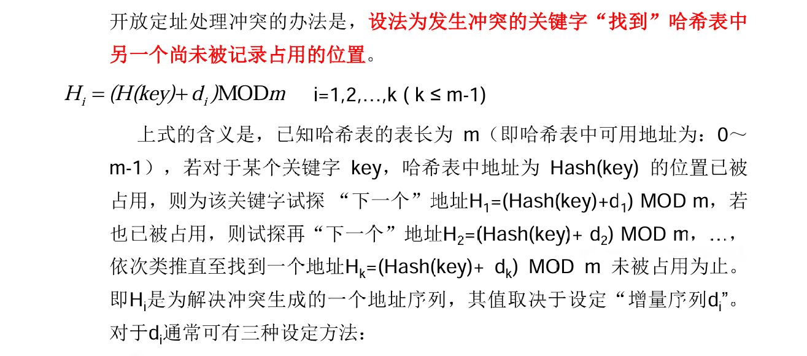

# 查找表

---
<!-- TOC -->
* [查找表](#查找表)
  * [1.查找的定义](#1查找的定义)
  * [2.静态查找表(Static Search Table)](#2静态查找表static-search-table)
    * [1）顺序查找](#1顺序查找)
    * [2）二分查找](#2二分查找)
    * [3）索引顺序查找](#3索引顺序查找)
  * [3.动态查找表(Dynamic Search Table)](#3动态查找表dynamic-search-table)
    * [二叉排序树](#二叉排序树)
  * [3.哈希表](#3哈希表)
    * [1）哈希函数构造](#1哈希函数构造)
    * [2）冲突处理](#2冲突处理)
<!-- TOC -->

---

## 1.查找的定义

- **查找表**(Search Table)是由同一类型的数据元素(或记录)构成的集合。  
- 查找表中的数据元素称为**关键字**，每个关键字有一个或多个与之相关的数据元素，这些数据元素称为**记录**。
- **主关键字**：可以唯一的标识一个记录的关键字
- **次关键字**：标识若干记录的关键字
- **平均查找长度**(ASL)：查找成功时，查找过程中关键字的比较次数的期望值

## 2.静态查找表(Static Search Table)

### 1）顺序查找

- **顺序查找**：从表的最后一个记录开始，逐个进行查找，直到找到所需的元素或查找完整个表(到达第一个记录)。
- 哨兵：将表的第一个记录值设置为查找值，当返回的下标为0时，说明查找失败。
- ASL：(n+1)/2

### 2）二分查找

- **二分查找**：在有序表中，取中间位置的记录进行比较，若相等则查找成功；若不等，则根据大小关系确定下一步查找的方向，直到查找成功或失败。
- 结束条件：low > high
- ASL：log2(n+1)

```java
private static int binarySearch(int[] arr, int target, int left, int right) {
        if (left > right) {
            return -1;
        }
        int mid = (left + right) / 2;
        if (arr[mid] == target) {
            return mid;
        } else if (target > arr[mid]) {
            return binarySearch(arr, target, mid + 1, right);
        } else if (target < arr[mid]) {
            return binarySearch(arr, target, left, mid - 1);
        }
        return -1;
    }
```

### 3）索引顺序查找

- 思想：建立一个索引表，用于存储原无序表中某一段记录的最大值和对应位置，查找时先通过二分查找索引表确定查找范围，再在范围内进行顺序查找。
- ASL：log2(n+1) + n/m


## 3.动态查找表(Dynamic Search Table)

### 二叉排序树

- **二叉排序树**：一棵空树或者具有以下性质的二叉树：
    - 若左子树不空，则左子树上所有结点的值均小于它的根结点的值
    - 若右子树不空，则右子树上所有结点的值均大于它的根结点的值
    - 左、右子树也分别为二叉排序树

- **查找**：从根结点开始，若查找值等于根结点的值，则查找成功；若查找值小于根结点的值，则在左子树中查找；若查找值大于根结点的值，则在右子树中查找。
- 结束条件：查找值等于根结点的值或者查找到空树
- **插入**：从根结点开始，若插入值等于根结点的值，则插入失败；若插入值小于根结点的值，则在左子树中插入；若插入值大于根结点的值，则在右子树中插入。如果左右子树是空树，就新建一个叶子节点插入。
- **删除**：删除结点时，分三种情况：
    - 被删除结点是叶子结点：直接删除
    - 被删除结点只有一个孩子：删除结点后，将其孩子结点连接到被删除结点的父结点上
    - 被删除结点有两个孩子：找到被删除结点的中序前驱或中序后继结点，用其替代被删除结点，并更新节点的前驱后继关系，再删除中序前驱或中序后继结点。


## 3.哈希表

- **定义**：通过哈希函数将关键字映射到哈希表中的一个位置，以加快查找速度。
- 哈希函数：将关键字映射到哈希表中的位置，使得关键字尽可能分布均匀。
- 冲突：不同关键字通过哈希函数映射到同一个位置。

### 1）哈希函数构造

- 直接定址法：取关键字的某个线性函数值为哈希地址
- 数字分析法：事先分析关键字的分布规律，取关键字的若干位作为哈希地址
- 平方取中法：取关键字平方后的中间几位作为哈希地址
- 折叠法：将关键字分割成几部分，取舍去进位的叠加和作为哈希地址
- 除留余数法：取关键字除以某个不大于哈希表长度的素数的余数作为哈希地址
- 随机数法：取关键字的随机函数值作为哈希地址

### 2）冲突处理

**开放定址法**：发生冲突时，根据某种规则在哈希表中的其他位置寻找空闲位置。

- 线性探测法：Di = 1, 2, 3, ...,k(k<=m-1)
- 二次探测法：Di = 1^2, -1^2, 2^2, -2^2, ..., k^2, -k^2(k<=m/2)
- 随机探测法：Di = rand(1, m-1)
> - 查找成功的ASL:查找每个关键字需要比较次数的均值
> - 查找失败的ASL:假设查找元素不存在，直到查找到空位返回时需要几次比较

**再哈希法**：发生冲突时，根据另一个哈希函数重新计算哈希地址。  
**链地址法**：将哈希表中冲突的元素存储在同一个链表中。  
**公共溢出区法**：将哈希表中冲突的元素存储在同一个溢出区中。