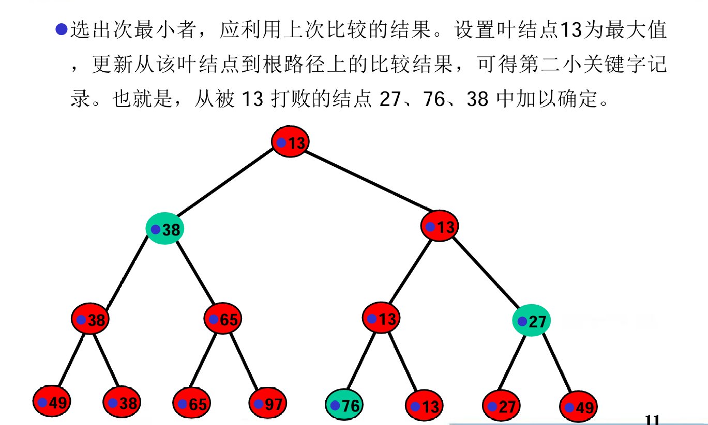

# 排序

---

* [排序](#排序)
  * [1.概念](#1概念)
  * [2.插入排序](#2插入排序)
    * [直接插入排序](#直接插入排序)
    * [折半插入排序](#折半插入排序)
    * [2-路插入排序](#2-路插入排序)
    * [表插入排序](#表插入排序)
    * [希尔排序](#希尔排序)
  * [3.快速排序](#3快速排序)
    * [冒泡排序](#冒泡排序)
    * [快速排序](#快速排序)
  * [4.选择排序](#4选择排序)
    * [简单选择排序](#简单选择排序)
    * [树形选择排序](#树形选择排序)
    * [堆排序](#堆排序)
  * [5.归并排序](#5归并排序)
  * [6.基数排序](#6基数排序)
  * [7.排序算法性能](#7排序算法性能)

---

## 1.概念

- **排序**的定义：将一个数据元素(或记录)的任意序列，重新排列成一个按关键字有序的序列。
- **主关键字**：排序结果唯一。
- **次关键字**：排序结果不唯一。
- **稳定性**：如果排序算法是稳定的，对于相同的关键字，排序前后的相对位置不变。

## 2.插入排序

### 直接插入排序
**思想**：每次将一个记录插入到已经排好序的有序表中，从而得到一个新的、记录数增1的有序表。

步骤：
- 1.设置哨兵R\[0],将待插入记录R\[i]复制到R\[0]。
- 2.从后向前查找插入位置，若R\[j].key < R\[0].key < R\[j+1].key，则将R\[j+1]和之后的元素后移。
- 3.将R\[0]插入到R\[j+1]的位置。

时间复杂度：O(n^2)

### 折半插入排序
**思想**：在直接插入排序的基础上，通过折半查找的方式找到插入位置。

时间复杂度：O(n^2)（虽然减少了查找时间，但每次移位时间不变）

### 2-路插入排序
**思想**：建立一个循环数组d，将第一个元素作为基准，插入时比较大小，如果大于基准则从后向前插入，否则从前向后插入。

时间复杂度：O(n^2)

### 表插入排序
**思想**：建立一个存放下标的链表(减少插入时的移动)，每次插入时，从头开始查找插入位置。

时间复杂度：O(n^2)

### 希尔排序
**思想**：根据长度确定“增量”，每次根据增量分割序列，对每个子序列进行插入排序。

增量选择：2^(t-k-1) - 1(t = log2(n+1), k = 1,2,3,...)  
时间复杂度：O(n^1.5)

## 3.快速排序

### 冒泡排序
**思想**：两两比较相邻记录的关键字，如果反序则交换，每一趟把最大的元素放到最后。

时间复杂度：O(n^2)  
改进：增加标志位，记录上一次交换的位置，减少比较次数。

### 快速排序
**思想**：每趟排序确定一个“枢轴”把序列分成两部分，左边的元素都小于枢轴，右边的元素都大于枢轴。

如何确定枢轴：  
- 先把数轴放在R[0],腾出空位
- L指向第一个元素，R指向最后一个元素
- 先检查R指向的元素，如果大于枢轴，则R左移，否则将R的元素赋值给枢轴所在位置，此时R指向的位置腾出空位
- 然后扫描L指向的元素，如果小于枢轴，则L右移，否则将L的元素赋值给R的空位，此时L指向的位置腾出空位
- 重复上述过程，直到L=R，将枢轴赋值给L

> 总体来看，确定枢轴的过程是左右交替扫描，互相腾空位的过程  
> 为了防止枢轴最大或最小，可以在R[0]、R[mid]、R[R]中选择中间值作为枢轴

## 4.选择排序

### 简单选择排序
**思想**：每次从待排序的记录中选出关键字最小的记录，与未排序部分的第一个记录交换位置。

时间复杂度：O(n^2)

### 树形选择排序

### 堆排序

- 大顶堆：根节点的关键字大于左右子树的关键字
- 小顶堆：根节点的关键字小于左右子树的关键字

**思想**：把待排序序列看作一个顺序结构存储的数，通过调整使其成为大顶堆/小顶堆，然后依次交换根节点和最后一个节点，再调整堆。

[排序过程](https://www.bilibili.com/video/BV1jz4y1M7HE)：
- 构建大顶堆：
- - 从最后一个非叶子节点开始，从下往上调整
- - 每次调整：比较根节点和左右子树，如果根节点小于左右子树中的最大值，则交换
- 根据堆排序：
- - 交换根节点和未排序序列的最后一个节点，然后调整堆
- - 依次交换，直到堆中只有一个元素，排序结束
> 堆排序实际上利用了完全二叉树的性质，通过调整树的结构，使得根节点是最大/最小值，然后把根节点和最后一个节点交换，再调整堆，直到排序完成。

时间复杂度：O(nlogn)

## 5.归并排序

**思想**：将待排序序列分成若干个子序列，每个子序列都是有序的，然后再把有序子序列合并成一个有序序列。

排序过程：
- 把待排序序列分成若干个子序列，每个子序列只有一个元素
- 两两合并，得到若干个有序子序列
- 重复第二步，合并两个序列时，循环比较两个序列的第一个元素，把小的元素放到新序列中
- 直到合并成一个有序序列

时间复杂度：O(nlogn)

## 6.基数排序

- MSD:最高位优先
- LSD:最低位优先 √

**思想**：从低位到高位依次对每一位进行排序，每次排序都是稳定的，最终得到有序序列。

排序过程：
- 从最低位开始，根据最低位大小把元素分配到0-9的桶中，桶采用链式存储
- 按照桶的顺序，把元素重新放回原序列
- 重复上述过程，直到最高位

时间复杂度：O(d*n),d为关键字的位数

## 7.排序算法性能

